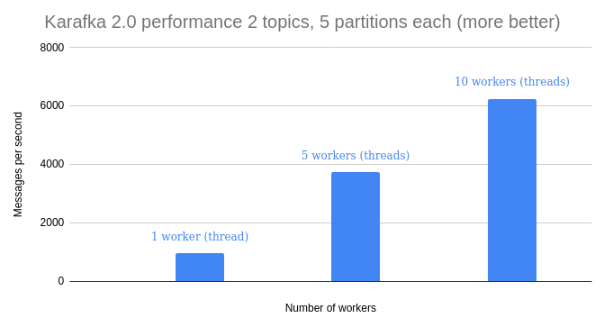
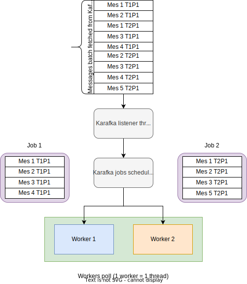

Karafka uses native Ruby threads to achieve concurrent processing in two scenarios:

- for concurrent processing of messages from different topics partitions
- to handle consumer groups management (each consumer group defined will be managed by a separate thread)

## Parallel messages processing

Karafka `2.0` allows you to process data in multiple threads at the same time for messages coming from different topics partitions.

When a message batch is fetched from Kafka, Karafka will split incoming messages into separate jobs based on the their topics and partitions. Those jobs will be then put on a queue from which a poll of workers can consume. All the ordering warranties will be preserved.

Using multiple threads for IO intense work can bring great performance improvements to your system "for free".

<p align="center">
  
</p>

You can control number of workers you want to start by using the `concurrency` setting:

```ruby
class KarafkaApp < Karafka::App
  setup do |config|
    # Run two processing threads
    config.concurrency = 2
    # Other settings here...
  end
end
```

<p align="center">
  
</p>

**Note**: Please keep in mind, that if you scale horizontally and end up with one Karafka process being subscribed only to a single topic partition, Karafka will always consume messages from only from a single topic partition and will not be able to process anything in parallel.

There will be a feature that will allow you to parallelize processing of a single topic partition data, but it is still under development.

## Consumer group multi-threading

Since each consumer group requires a separate connection and a thread we do this concurrently.

It means, that for each consumer group, you will have one additional thread running. For high-load topics, there is always an IO overhead on transferring data from and to Kafka, this approach allows you to consume data concurrently.
